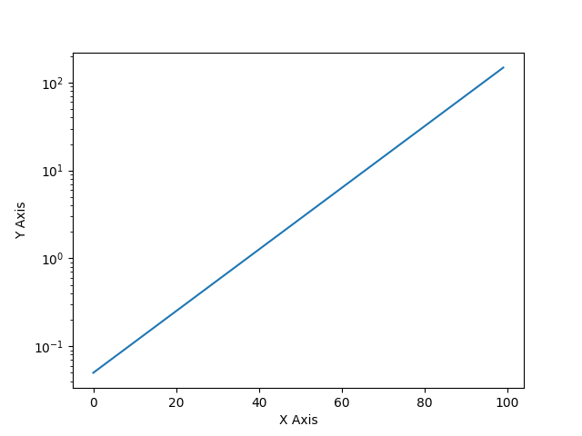

# Complex Systems Modelling - UiT 

`uit-cosmo` is a github organization providing numerical tools for creating, analyzing and visualizing data from complex systems. 

This guide is meant for students and employees of the complex systems modelling group at UiT. External collaborators or people with interest in the groups work are also welcome to use and contribute to the provided repositories. 

The latex expressions in this guide are created with [`readme2tex`](https://github.com/leegao/readme2tex). 

- [Repositories](#repos)
    - [superposed-pulses](#superposed-pulses)
    - [2d-propagating-blobs ](#2d-propagating-blobs)
    - [fpp-analysis-tools](#fpp-analysis-tools)
    - [fpp-closed-expressions ](#fpp-closed-expressions)
    - [cosmoplots](#cosmoplots)
    - [xblobs](#xblobs)
    - [Complexity-Entropy-Analysis](#Complexity-Entropy-Analysis)
    - [ebm](#ebm)
    - [SOFTX-D-16-00023](#SOFTX-D-16-00023)
    - [uit_sandpiles](#uit_sandpiles)
    - [PhD-thesis](#PhD-thesis)

- [Publication specific repositories](#pub-repos)
    - [dirac-comb-and-exponential-frequency-spectra-in-nonlinear-dynamics](#dirac) 
- [Contributing to uit-cosmo ](#contributing)

## Repositories
### superposed-pulses
This repository provides numerical realizations of stochastic processes, given by a superposition of pulses. For a given time  the process  can be written as

Here, the random variables are defined as follows:  stands for the number of pulses arriving in the time interval ,  is the pulse amplitude,  the pulse arrival time,  the pulse shape and  for the duration time. In the default case, these parameters are chosen so that  is a Filtered Poisson Process with exponential pulses, however all variables can be chosen freely. See `superposed-pulses/mode/example.py` for further details. An example of a realization in the default case is shown below:

### 2d-propagating-blobs

This repository can be regarded as an extension of superposed pulses by adding one or two spatial dimensions. The model is motivated by 2d propagating blobs in the scrape-off layer of fusion experiments, but can be used for any 1d or 2d system consisting of advecting pulses. An example is shown below.

Similarly to `superposed-pulses` all stochastic variables of the model can be chosen freely. The `README.md` file of the repository contains a documentation. Also the examples directory might be useful.

### fpp-analysis-tools
This repository provides a range of tools to analyze time series of intermittent fluctuations. Functions for the following tasks are provided:
- conditional averaging
- calculating correlation functions 
- deconvolution of Filtered Point Processes
- calculating distribution functions
- estimating Hurst exponents
- excess statistics 
- calculating running moments
- parameter estimation from the empirical characteristic function
- peak detection

This repository is meant as a centralized hub for functions and methods for time series analysis. Whenever you develop new methods for this purpose, we encourage you to add them to this repository to make them available for other group members. 
### fpp-closed-expressions 
This repository is a collection of closed expressions for the most common functions related to shot noise processes such as expressions for PDFs, excess time statistics, PSDs and autocorrelation functions. Similarly to `fpp-analysis-tools` we encourage you to add newly derived expressions whenever you derive and/or publish any to make them available to other group members. 
### cosmoplots 
`cosmoplots` provides default configurations for producing quality plots. We recommend using `cosmoplots` whenever you produce plots for manuscripts, talks or presentations. An example showing the advances of `complotots` compared to standard `matplotlib` is shown below. See the `README.md` file of the repository for a simple example.
| `matplotlib` | `cosmoplots` |
| :--------: | :--------: |
|  |  |
### xblobs
`xblobs` is a python tool to detect and analyse coherent structures in turbulence using xarray. The algorithm has been developed originally to detect and track coherent structures (blobs) in plasma turbulence simulations, but it can be applied on any 2D xarray Dataset with a Cartesian grid and constant spacing `dx`, `dy` and `dt`. Documentation is provided in the `README.md` file. An example is shown below:
 

### Complexity-Entropy-Analysis
### ebm
### SOFTX-D-16-00023
### uit_sandpiles
### PhD-thesis
This repository contains the latex code of Gregor Decristoforo's PhD thesis. If you are looking for a latex template for your thesis at UiT this might be useful. A Makefile for compiling the latex code and instructions how to access the front page from the UiT website are provided. 

 ## Publication specific repositories
### dirac-comb-and-exponential-frequency-spectra-in-nonlinear-dynamics
Repository containing scripts to generate and plot data used in Manuscript "Dirac comb and exponential frequency spectra in nonlinear dynamics" (arXiv:2106.15904).

 ## Contributing to uit-cosmo
Contributions of any kind are welcome!

The workflow used is essentially ["GitHub flow"](https://docs.github.com/en/get-started/quickstart/github-flow). The **main** branches of most repositories are protected from direct commits. Instead, do the following:
1. Create a new feature branch
2. (Optional) Push feature branch to Github to share and create backup
3. Commit changes to the feature branch
4. Submit pull request into **main** branch 

For new repositories, please provide a license (we recommend MIT) and a useful README file containing installation instructions and a simple example. Make sure that your code contains useful documentation (docstrings, examples, etc.).

## TODO list:
- [ ] unify naming conventions across repositories
- [ ] unify documentation across repositories
- [ ] provide tests for all repositories
